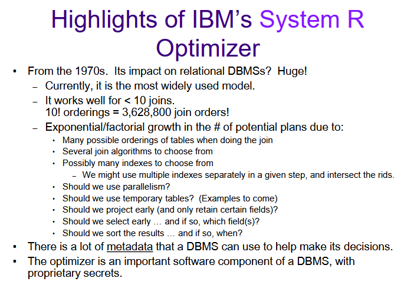
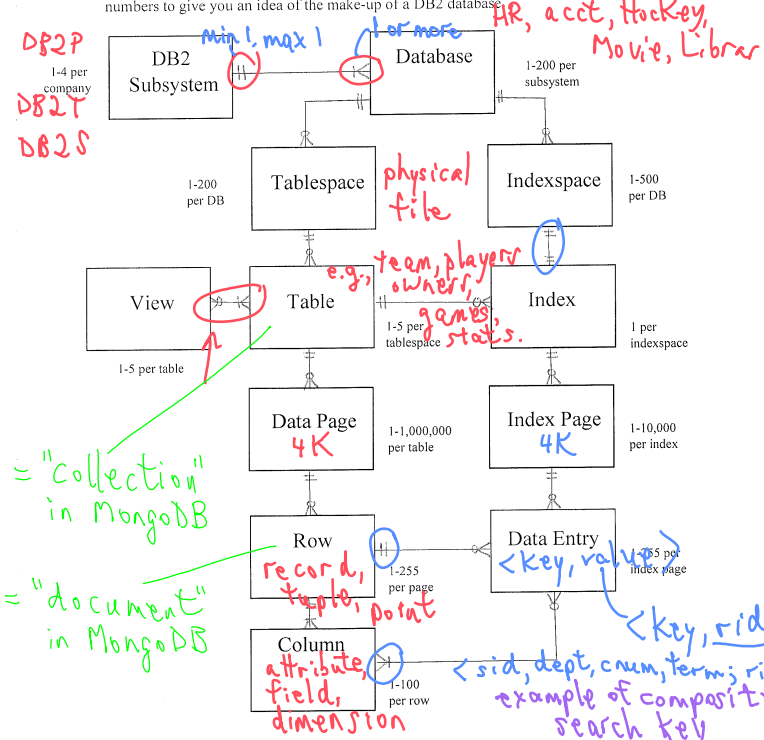

# Goals

## disk seek project
**Project:**

I want to write a disk management system that can simulate accessing a file on disk as well as seek time, transfer time and rotation time
- a user should be able to set up the disk with platters, cylinder counts and double sided-ness
- a user should be able to request a list of pages
- a user should be able to change the algorithm for seek from Elevator, FCFS: first come first servers   SSTF: shortest seek time first and C-SCAN:
- a user should be able to benchmark the time it takes for an execution

**C++ learning:**
- compiler, linker and libraries

## Buffer Pool Cache

**C++ learning:**
- Google C++ style guides

## Creating tables on simulated "disk" with "file" constraints
- set up tables

  - with ability to create records in a table
  - column data types char, int(4), int(8) etc
  - PK

**C++ learning:**
- Pointers, dynamic memory and cleanup

## Indexes
### B+ Tree Index
### Extendible Hashing
### Linear Hashing

# more ideas :)

the biggest part of this is that you can abstract certain sections for toy examples

- graphical disk

-> set up disk as files
-> read and write to disk
-> read min page access to disk

- set up seek, rotation and transfer time simulation //skip this part but track I/Os
  -> set up buffer pool
  -> set up caching alg

- set up tables

  - with ability to create records in a table
  - column data types char, int(4), int(8) etc
  - PK

- add query with no filter

- add b+ tree indexes
- add hashing

  - add EH
  - add LH

- raw joins

  - PNL, BNL default, BNL Hash optimized
  - INL, SMJ naive, SMJ optimized, HJ

- query optimizer
